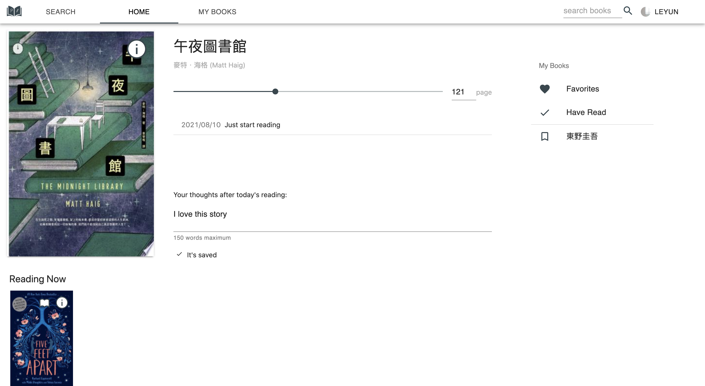
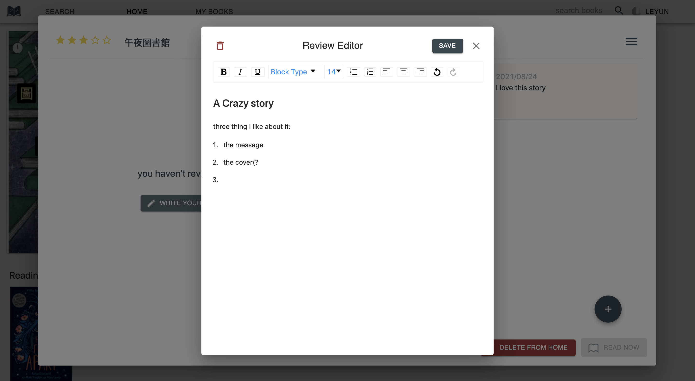

## My booktracker

**My 2021 summer side project :)** 

A book tracking application build with *react, express,  mongodb and Google book API*. User have access to an entire library that offers book searching, bookshelf management and reading progress tracking.







- #### Author

  - ###### Leyun Fu(me)

- #### Demo Link: I don't have it yet :(  

- #### What is the application about?

  A book tracking application bases on Google books API. 

  - **Without Google login**: User can search books based on keywords and see the details of the books such as title, author, description...etc.
  - **With Google login**: 
    - User have access to their own personal library that includes 4 default bookshelves: *Favorites, Reading now, To read, and Have read*, and a big "*home book*" spot at the top of the home page.
    - **Bookshelf**: user can add/move/remove book from any bookshelf.
    - **Books in any bookshelf**: user can add notes, write review or rate the book from 1 to 5.
    - **Home book**: once you set a book to be your homebook, you have access to a progress tracking slider and a textfield to let you write your thought on the book after today's reading.

- #### What Framework/library did I use?

  **Frontend**: 

  ​	- main: react, redux,  javascripts

  ​	- UI: antd, material-ui

  ​	- other library: react-router-dom, react-rating, draft-js, react-draft-wysiwyg, data-fans

  **Backend**: nodeJS, express, axios

  **Database**: mongoDB

  **API**: Google books

- #### **Deploy Link: **  It's removed for now. 

  (obviously, you can find it in previous commit, lol)

  ***warning: best experience using desktop full screen, I will work on RWD :(*** 

  Since I didn't verified the app to Google yet, only test user can log in. The book searching still work though.

- #### How do I run and test "my booktracker" at localhost?

  clone repo

  ```
  git clone https://github.com/leyunn/my-booktracker.git
  ```

  Install

  ```
  npm install
  cd frontend
  // at frontend
  npm install
  npm run build 
  ```

  Create env file for Mongo db connection

  ```
  cd .. 
  // at my-booktracker
  touch .env
  open .env
  write “MONGO_URL=...(your mongo db database link)”
  ```

  Now you can 

  ```
  // at my-booktracker
  npm start
  "my booktracker" is running at localhost:8080!
  ```

  

  

